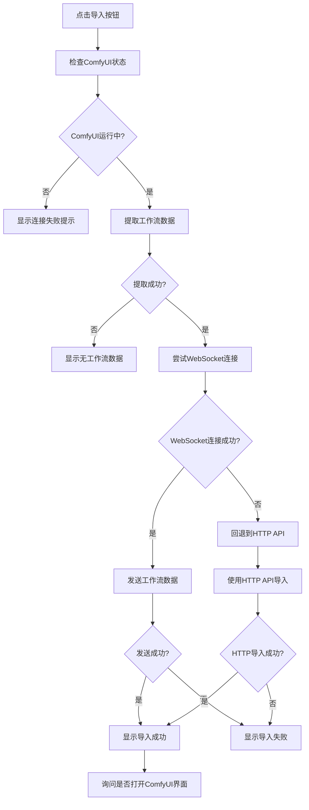

# WebSocket 集成功能说明

## 概述

本工具新增了基于 WebSocket 的 ComfyUI 工作流导入功能，提供更稳定、更直接的工作流加载体验。

## 功能特点

### 🚀 双重导入机制

1. **WebSocket 优先**: 使用 WebSocket 直接发送 `load_workflow` 消息到 ComfyUI
2. **HTTP API 备用**: 如果 WebSocket 失败，自动回退到传统的 HTTP API 方式

### 🔗 WebSocket 连接

- **实时连接**: 建立与 ComfyUI 的实时 WebSocket 连接
- **自动重连**: 连接失败时自动尝试重新连接
- **状态监控**: 实时监控连接状态和消息

### 📡 消息协议

按照 ComfyUI 官方协议，发送标准的工作流加载消息：

```json
{
    "type": "load_workflow",
    "workflow": {
        // 完整的工作流 JSON 数据
    }
}
```

## 使用方法

### 1. 基本使用

1. 确保 ComfyUI 正在运行（默认地址：`http://127.0.0.1:8188`）
2. 在图片信息界面点击 "🎯 导入ComfyUI" 按钮
3. 工具会自动：
   - 检查 ComfyUI 运行状态
   - 提取图片中的工作流数据
   - 通过 WebSocket 发送到 ComfyUI
   - 在 ComfyUI 界面中自动加载工作流

### 2. 配置连接

如果 ComfyUI 运行在非默认地址，可以通过配置弹窗设置：
- **主机地址**: ComfyUI 服务器 IP（如 `127.0.0.1` 或远程 IP）
- **端口号**: ComfyUI 服务器端口（默认 `8188`）

### 3. 导入流程



## 技术实现

### WebSocket 连接管理

```python
class ComfyUIIntegration:
    def connect_websocket(self) -> bool:
        """建立WebSocket连接"""
        # 创建WebSocket连接
        self.ws = websocket.WebSocketApp(
            self.ws_url,
            on_open=on_open,
            on_close=on_close,
            on_error=on_error,
            on_message=on_message
        )
        
        # 后台线程运行
        ws_thread = threading.Thread(target=run_ws, daemon=True)
        ws_thread.start()
```

### 工作流加载

```python
def load_workflow_via_websocket(self, workflow_data: Dict[str, Any]) -> bool:
    """通过WebSocket加载工作流"""
    message = {
        "type": "load_workflow",
        "workflow": workflow_data
    }
    
    self.ws.send(json.dumps(message))
    return True
```

### 错误处理

- **连接超时**: 5秒连接超时，自动回退到HTTP API
- **发送失败**: WebSocket发送失败时显示详细错误信息
- **格式验证**: 发送前验证工作流数据格式的有效性

## 支持的工作流类型

### ✅ 完全支持

1. **Flux 工作流**
   - UNETLoader + DualCLIPLoader + VAELoader
   - SamplerCustomAdvanced + FluxGuidance
   - RandomNoise + BasicScheduler

2. **SDXL 工作流**
   - CheckpointLoaderSimple
   - KSampler/KSamplerAdvanced
   - 各种 conditioning 节点

3. **标准 SD 1.5 工作流**
   - CheckpointLoader
   - KSampler
   - CLIPTextEncode

### 🔄 自动检测

工具会自动检测工作流类型并相应处理：
- 检测关键节点类型
- 分析节点连接关系
- 提取对应的参数信息

## 故障排除

### 常见问题

1. **WebSocket 连接失败**
   ```
   解决方案：
   - 检查 ComfyUI 是否正在运行
   - 确认端口号是否正确（默认8188）
   - 检查防火墙设置
   ```

2. **工作流加载失败**
   ```
   解决方案：
   - 确认图片包含有效的 ComfyUI 工作流数据
   - 检查工作流 JSON 格式是否正确
   - 尝试使用HTTP API备用方案
   ```

3. **远程连接问题**
   ```
   解决方案：
   - 启动 ComfyUI 时添加 --listen 参数
   - 确保网络连接正常
   - 检查远程服务器防火墙设置
   ```

### 调试信息

工具会在控制台输出详细的调试信息：
```
WebSocket连接已建立
工作流已通过WebSocket发送到ComfyUI
收到消息: execution_start
```

## 配置文件

WebSocket 配置保存在 `data/comfyui_config.json`：

```json
{
    "host": "127.0.0.1",
    "port": 8188
}
```

## 依赖要求

新增依赖：
```
websocket-client>=1.0.0
```

确保在使用前安装：
```bash
pip install websocket-client
```

## 更新日志

### v1.0.0 (2024-12-XX)
- ✨ 新增 WebSocket 集成功能
- 🔄 双重导入机制（WebSocket + HTTP API）
- 🎯 实时工作流加载
- 📡 标准消息协议支持
- 🛠️ 完善的错误处理和回退机制

---

通过这个 WebSocket 集成功能，用户现在可以更便捷、更稳定地将图片中的工作流导入到 ComfyUI 中，实现真正的"一键导入"体验！ 